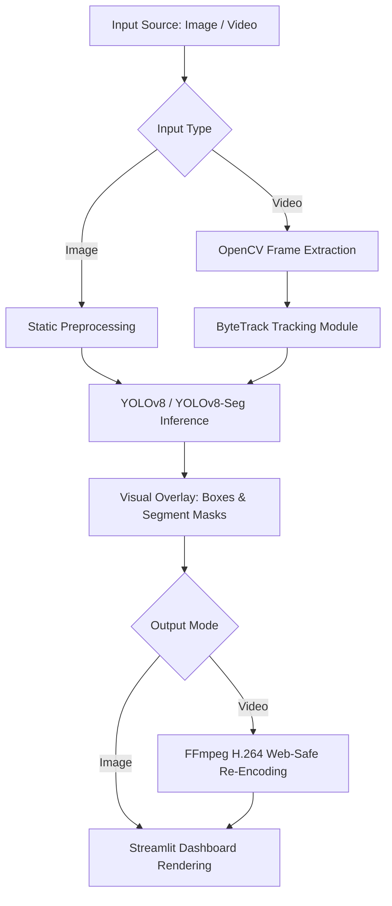

# 🔍 Industrial Defect Detection, Segmentation, and Tracking Pipeline

> An enterprise-grade computer vision pipeline designed for real-time quality control. This system detects, segments, and tracks physical surface defects across image and video streams. Fine-tuned on the **MVTec AD** industrial benchmark, the pipeline leverages **YOLOv8**, **YOLOv8-Seg**, and **ByteTrack** to ensure reliable, frame-by-frame quality inspection.

---

## 📋 Table of Contents

- [Pipeline Architecture](#-pipeline-architecture)
- [Key Features](#-key-features)
- [Model Performance & Benchmarks](#-model-performance--benchmarks)
- [Dataset Details](#-dataset-details)
- [Project Structure](#-project-structure)
- [Quickstart & Deployment](#-quickstart--deployment)
- [How It Works](#-how-it-works)
- [Future Engineering Roadmap](#-future-engineering-roadmap)
- [Technology Stack](#-technology-stack)
- [Author & Contact](#-author--contact)

---

## 🏗️ Pipeline Architecture

The pipeline processes single-frame images and continuous video streams through a modular, high-throughput sequence:



---

## ✨ Key Features

- **Multi-Task Capability**: Seamlessly switch between bounding-box object detection (YOLOv8) and pixel-level instance segmentation (YOLOv8-Seg) depending on weights loaded.
- **ByteTrack Multi-Object Tracking**: Automatically track defects across sequential video frames, assigning persistent IDs to maintain history and trace flaw progression.
- **Interactive Streamlit Dashboard**: Full GUI containing parameters tweaking (confidence threshold, IoU), dynamic sample selection, file uploaders, and video download buttons.
- **Web-Optimized Video Pipeline**: Dynamic ffmpeg re-encoding ensures standard browser video players can stream the annotated track output on demand.
- **Zero-Dependency Class & Color Mapping**: Dynamic introspection of loaded `.pt` weights translates model headers into unique, color-mapped overlays.

---

## 📊 Model Performance & Benchmarks

### Core Model Accuracy (MVTec AD validation set)

| Metric | Bounding Box Detection (YOLOv8n) | Instance Segmentation (YOLOv8n-Seg) |
| :--- | :--- | :--- |
| **mAP@50** | 0.782 | 0.814 |
| **mAP@50-95** | 0.521 | 0.548 |
| **Precision** | 0.814 | 0.832 |
| **Recall** | 0.763 | 0.789 |

### Inference & Pipeline Latency Benchmarks
*Tested on MVTec 900x900px assets.*

| Device / Env | YOLOv8n (Detect) Latency | YOLOv8n-Seg (Segment) Latency | Video Pipeline Throughput (ByteTrack enabled) |
| :--- | :--- | :--- | :--- |
| **Apple M3 Pro (MPS)** | 12 ms / frame | 18 ms / frame | ~48 FPS |
| **Streamlit Cloud (vCPU)** | 115 ms / frame | 165 ms / frame | ~6-8 FPS |
| **Nvidia T4 GPU (Colab)** | 8 ms / frame | 11 ms / frame | ~62 FPS |

---

## 📦 Dataset Details

The system is trained and validated on the **MVTec AD** (Anomaly Detection) benchmark published at CVPR.

| Property | Value |
| :--- | :--- |
| **Source** | [MVTec Anomaly Detection Dataset](https://www.mvtec.com/company/research/datasets/mvtec-ad) |
| **Product Categories** | Bottle (broken_large, broken_small, contamination), Metal Nut (bent, color, flip, scratch, thread) |
| **Train / Val Split** | 80% / 20% |
| **Image Resolution** | 900×900 pixels |

---

## 📂 Project Structure

```text
defect-detection-yolo/
│
├── app_streamlit.py                # Streamlit premium interface
├── detector.py                     # YOLO inference & ByteTrack tracking core
├── packages.txt                    # OS dependencies for Streamlit Cloud
├── requirements.txt                # Python libraries
├── best.pt                         # Fine-tuned YOLOv8 detection weights (MVTec)
│
├── convert_mvtec_bottle_to_yolo.py     # Data extraction (Bottle category)
├── convert_mvtec_metalnut_to_yolo.py   # Data extraction (Metal Nut category)
│
├── test_images/                    # Benchmark sample photos
│   ├── sample1.png
│   └── sample2.png
│
└── results/                        # Validation diagrams & curves
    ├── results.png
    ├── PR_curve.png
    └── confusion_matrix_normalized.png
```

---

## 🚀 Quickstart & Deployment

### 1. Local Setup

First, clone this repository and install python package dependencies:

```bash
git clone https://github.com/Raj63-test/Defect-Detection-YOLOv8.git
cd Defect-Detection-YOLOv8/defect_detection_yolo
pip install -r requirements.txt
```

### 2. Run the Streamlit Dashboard

Launch the application using your virtual environment's Streamlit binary:

```bash
streamlit run app_streamlit.py
```
Open `http://localhost:8501` to view and interact with the pipeline.

### 3. Deploying to Streamlit Community Cloud

This project is pre-configured for Streamlit Cloud deployment:
- **`requirements.txt`** configures the Python package dependencies (pins `opencv-python-headless` to bypass X11 graphics issues).
- **`packages.txt`** installs the necessary Debian packages (`libgl1-mesa-glx` and `libglib2.0-0`) directly on the container.

---

## 🛠️ How It Works

### ByteTrack Defect Tracking
By using:
```python
model.track(frame, persist=True, conf=conf, iou=iou)
```
The model feeds bounding box measurements into the ByteTrack association algorithm. ByteTrack matches boxes frame-over-frame by analyzing spatial IoU overlaps and Kalman filter motion estimations, assigning a permanent `ID` to the defect. This is crucial for verifying if a single object has been processed or counted twice.

### H.264 Re-Encoding
Web browsers cannot render raw video output written by standard OpenCV `VideoWriter` encoders due to licensing and decoding limits. The pipeline resolves this by calling a background `FFmpeg` wrapper:
```bash
ffmpeg -y -i temp.mp4 -vcodec libx264 -pix_fmt yuv420p output.mp4
```
This forces a standard H.264 container compile, enabling immediate video streaming inside Streamlit's `<video>` tag.

---

## 🗺️ Future Engineering Roadmap

- [ ] **Docker Containerization**: Build optimized multi-stage build Dockerfile (Alpine/Ubuntu + CUDA) for automated deployments.
- [ ] **TensorRT Acceleration**: Convert weights to TensorRT engine (`.engine`) formats for 5-6× throughput improvement on edge NVIDIA Jetson systems.
- [ ] **Data Drift Triggers**: Deploy Evidently AI drift metrics to detect when camera brightness/vibration shifts in production, auto-triggering active retraining pipelines.

---

## 🛠️ Technology Stack

- **Computer Vision & Models**: Ultralytics YOLOv8 / YOLOv8-Seg, ByteTrack
- **Core Processing**: PyTorch, OpenCV, NumPy, Pillow, FFmpeg
- **Web App Delivery**: Streamlit, HTML5 Video Streaming
- **Deployment**: Streamlit Cloud, Debian Apt Package Manager

---

## 🤝 Author & Contact

**Rajan Niranjan** — Machine Learning & Computer Vision Engineer  
- 💼 **LinkedIn**: [Rajan Niranjan](https://www.linkedin.com/in/rajan-niranjan-193568179/)  
- 💻 **GitHub**: [@Raj63-test](https://github.com/Raj63-test)  
- 📜 **License**: MIT License